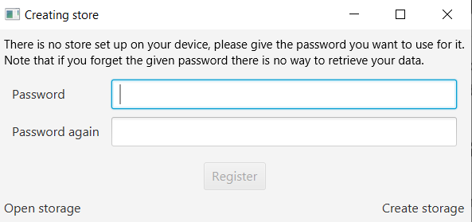
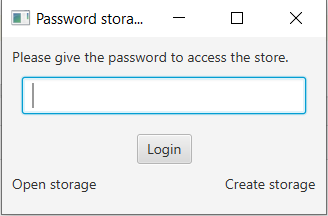
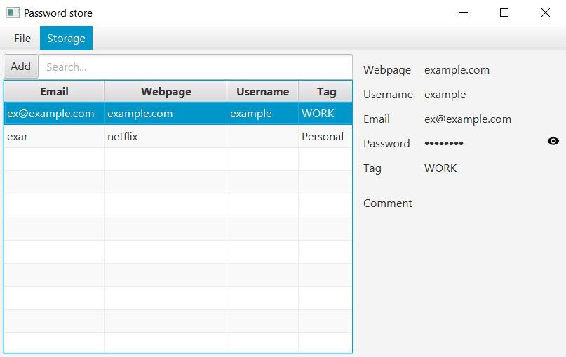
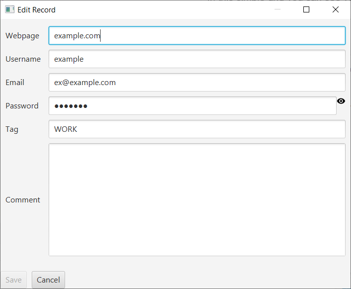

# User manual - Password storage
This application can store your passwords safely.
Let's see its features.
It has a default storage file, but you can create separate files as well easily.

## Creating store

If you haven't set up your storage or if you're creating a new one, you must give your password which we'll use to encrypt your 
data.

For safety you have to give the desired password twice, the program will only let you create it, if the two passwords match.
It is important to remember this password, because without it the data can not be recovered.

## Login to the store

In a simple window you must give your password.

If you have typed a wrong password, you will be prompted.

## Passwords management

In this simple grid you can see your password records, and you can see the selected one on the sidebar.
The password can be seen by clicking on the eye button, or by right click you can copy it to your clipboard.

For easier access you can use the searchbar, filtering the records by the webpage or the tag.

You can edit or delete a record by right clicking on it and selecting the needed option from the menu.
You can add new items by the add button left to the search bar.

On the menubar you can create new stores, or open others, and on the storage submenu you can change your password.

## Adding and editing records

You can use this simple form to edit your records (and add new ones).

